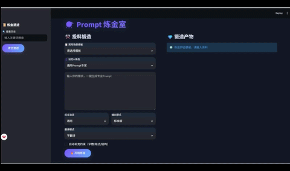

# ⚗️ Prompt Alchemy Lab | 赛博提示词炼金室

> **"一触即发，将混沌的思绪锻造成纯净的指令。"** > 本项目是一款基于 DeepSeek-V3 的工业级结构化提示词（Prompt）优化工具。

---

## 🚀 核心亮点 (Core Advantages)

### 1. 结构化锻造引擎 (RCT Framework)
不同于简单的文本扩充，本项目采用 **Role-Context-Task** 标准框架，将模糊的用户输入重构为大模型更易理解的逻辑块，显著提升 LLM 输出的稳定性与精确度。

### 2. 架构设计：逻辑与配置分离 (Decoupling)
- **解耦设计**：所有的角色预设（Roles）与场景模板（Templates）均存储于 `config.json`。
- **优势**：无需修改核心代码即可动态扩展业务场景，支持非技术人员维护提示词库，体现了工程化的代码整洁度。

### 3. 赛博压力感 UI (Immersive UX)
- **视觉风格**：采用深炭黑 (#121826) 搭配霓虹紫渐变，营造未来实验室氛围。
- **状态管理**：通过仪式感进度条与侧边栏“炼金日志”，解决 AI 生成过程中的“黑盒焦虑”，提供极致的交互反馈。

---

## 🛠️ 技术栈 (Tech Stack)

| 领域 | 技术方案 |
| :--- | :--- |
| **核心引擎** | Python 3.10 + OpenAI SDK |
| **模型大脑** | DeepSeek-V3 (DeepSeek-Chat) |
| **前端框架** | Streamlit + Custom CSS Injection |
| **部署运维** | GitHub + Streamlit Cloud |

---

## 📁 目录结构说明

```text
├── assets/             # 项目截图与演示 GIF
├── app.py              # 核心业务逻辑（UI 渲染与 API 交互）
├── config.json         # 角色与模板配置文件（解耦核心）
├── requirements.txt    # 环境依赖清单
├── .gitignore          # 屏蔽敏感信息（如 .env）
└── README.md           # 产品说明文档